# Generic Workflow Documentation

Complete guide to Product Backlog Item (PBI) and Task management workflows using the SDO CLI tool. These workflows are designed to work across different project management platforms while leveraging SDO as the primary interface.

## Overview

This documentation provides a comprehensive workflow system for managing development work across different platforms (Azure DevOps, GitHub, Jira), from initial feature planning through to deployment. The workflows are organized into three categories:

- **PBI Workflows**: Feature-level planning and delivery
- **Task Workflows**: Individual work item execution
- **Quality Workflows**: Cross-cutting validation processes

**Primary Tool**: SDO CLI - Unified interface for Azure DevOps, GitHub, and Jira
**Configuration**: See `project-config.yaml` for platform-specific settings

## Quick Start Decision Tree

```
┌─────────────────────────────────────────────────────────────┐
│ What do you need to do?                                      │
├─────────────────────────────────────────────────────────────┤
│                                                               │
│ 🆕 New Feature Idea?                                         │
│    └─→ PBI Creation (1)                                      │
│                                                               │
│ 📋 Ready for Sprint Planning?                               │
│    └─→ PBI Breakdown (2)                                     │
│                                                               │
│ 💻 Time to Code?                                             │
│    └─→ Task Implementation (6)                               │
│                                                               │
│ ✅ Finished Coding?                                          │
│    ├─→ Testing (9)                                           │
│    └─→ Code Review (8)                                       │
│                                                               │
│ 🎯 Feature Complete?                                         │
│    └─→ PBI Closure (4)                                       │
│                                                               │
└─────────────────────────────────────────────────────────────┘
```

## Prerequisites

### SDO CLI Tool Setup
```bash
# Install SDO (recommended)
pip install sdo
# or
pip install -e .  # if developing SDO

# Configure for your platform (see project-config.yaml for actual values)
sdo config set azure_devops.organization "[AZURE_DEVOPS_ORG]"
sdo config set azure_devops.pat "$AZURE_DEVOPS_PAT"
```

### Alternative Tools
If SDO is not available, workflows include alternative commands for:
- **Azure DevOps**: `az boards`, `az repos`, `az pipelines`
- **GitHub**: `gh issue`, `gh pr`, `gh workflow`
- **Jira**: `jira issue`, `jira sprint`

## Quick Navigation

### PBI Workflows (Product Backlog Items)

Feature-level lifecycle management:

1. **[Work Item Creation](workitem-creation-workflow.md)** - Define PBIs and Tasks
   - Business value analysis for PBIs
   - Acceptance criteria definition
   - Story point estimation for PBIs
   - Task breakdown and effort estimation

### Quality & Collaboration Workflows

Cross-cutting validation processes:

8. **[Code Review](code-review.md)** - PR creation and review
   - Create PR from `.temp/pr.md` (standardized temp location)
   - Use `sdo pr create --file .temp/pr.md --work-item <id>`
   - Work item linking
   - References [PR Squash Merge](actions/pr-squash-merge.md) workflow

9. **[PR Squash Merge](actions/pr-squash-merge.md)** - Squash merge guidance
   - Consolidate multiple commits into meaningful messages
   - Generate squash commit messages
   - Execute merge with GitHub CLI

10. **[Testing](testing.md)** - Quality assurance
   - Unit/integration testing
   - Cross-platform validation
   - Performance/security checks

## Complete Workflow Diagram

```mermaid
flowchart TD
    %% PBI Lifecycle
    A[💡 New Feature Idea] --> B["1️⃣ CREATE PBI<br>Business Value"]
    B --> C["2️⃣ BREAKDOWN<br>Sprint Planning"]
    C --> D["3️⃣ IMPLEMENT<br>Execute Tasks"]

    %% Task Creation Branch
    C --> E["📋 Create Tasks<br>• Task 1<br>• Task 2<br>• Task N"]

    %% Task Lifecycle Subgraph
    subgraph TASKS ["🎯 Individual Task Lifecycle"]
        F["5️⃣ CREATE<br>Define Task<br>[To Do]"]
        G["6️⃣ IMPLEMENT<br>Code Change<br>[Active]"]
        H["9️⃣ TEST<br>Unit → Integration → E2E<br>[Active]"]
        I["8️⃣ REVIEW<br>PR → Review → Merge<br>[Review]"]
        J["7️⃣ CLOSE<br>Mark Complete<br>[Done]"]

        F --> G --> H --> I --> J
    end

    E --> F
    D --> F

    %% Completion Check
    J --> K{All Tasks<br>Done?}
    K -->|No| F
    K -->|Yes| L["4️⃣ CLOSE PBI<br>Validate & Deploy<br>[Done]"]

    %% Styling
    classDef pbiPhase fill:#e1f5fe,stroke:#01579b,stroke-width:2px
    classDef taskPhase fill:#f3e5f5,stroke:#4a148c,stroke-width:2px
    classDef decision fill:#fff3e0,stroke:#e65100,stroke-width:2px
    classDef complete fill:#e8f5e8,stroke:#2e7d32,stroke-width:2px

    class B,C,D pbiPhase
    class F,G,H,I,J taskPhase
    class K decision
    class L complete
```

```mermaid
flowchart LR
    %% Task Implementation Detail
    A["5️⃣ CREATE<br>Define Task"] --> B["6️⃣ IMPLEMENT<br>Code Change"]
    B --> C["9️⃣ TEST<br>Unit → Integration → E2E"]
    C --> D["8️⃣ REVIEW<br>PR → Review → Merge"]
    D --> E["7️⃣ CLOSE<br>Mark Complete"]

    %% Status indicators
    A -.-> F(["To Do"])
    B -.-> G(["Active"])
    C -.-> G
    D -.-> H(["Review"])
    E -.-> I(["Done"])

    %% Styling
    classDef phase fill:#f3e5f5,stroke:#4a148c,stroke-width:2px
    classDef status fill:#e8f5e8,stroke:#2e7d32,stroke-width:1px

    class A,B,C,D,E phase
    class F,G,H,I status
```





## When to Use Each Workflow

| Situation | Workflow | Purpose |
|-----------|----------|---------|
| 💡 New feature idea | [Work Item Creation](workitem-creation-workflow.md) | Define business value and requirements |
| 📅 Sprint planning | [PBI Breakdown](pbi-breakdown.md) | Break PBI into tasks |
| ✏️ Need new task | [Work Item Creation](workitem-creation-workflow.md) | Define specific work item |
| 💻 Ready to code | [Work Item Start](workitem-start.md) | Complete start workflow |
| ✅ Code complete | [Testing](testing.md) → [Code Review](code-review.md) | Validate and review |
| 🎯 Task done | [Work Item Closure](workitem-closure.md) | Mark task complete |
| 🚀 Feature complete | [Work Item Closure](workitem-closure.md) | Validate entire feature |
| 🔄 Track progress | [Work Item Start](workitem-start.md) | Complete implementation workflow |

## Role-Based Quick Reference

### Product Owner
- Create PBIs: [Work Item Creation](workitem-creation-workflow.md)
- Review completed work: [Work Item Closure](workitem-closure.md)
- Approve features: [Work Item Closure](workitem-closure.md) Phase 3

### Development Team
- Plan sprints: [PBI Breakdown](pbi-breakdown.md)
- Implement tasks: [Work Item Start](workitem-start.md)
- Validate code: [Testing](testing.md)
- Submit changes: [Code Review](code-review.md)
- Coordinate work: [Work Item Start](workitem-start.md)

### Scrum Master
- Facilitate breakdown: [PBI Breakdown](pbi-breakdown.md)
- Track progress: [Work Item Start](workitem-start.md)
- Remove blockers: All workflows

## Common Patterns

### New Feature Development
1. [Work Item Creation](workitem-creation-workflow.md) - Product Owner defines feature
2. [PBI Breakdown](pbi-breakdown.md) - Team plans implementation
3. [Work Item Start](workitem-start.md) - Developers build (includes [Testing](testing.md))
4. [Code Review](code-review.md) - Submit PR for review
5. [Work Item Closure](workitem-closure.md) - Validate and release

### Bug Fix
1. [Work Item Creation](workitem-creation-workflow.md) - Define bug and impact
2. [Work Item Creation](workitem-creation-workflow.md) - Create fix task
3. [Work Item Start](workitem-start.md) - Implement fix (includes [Testing](testing.md))
4. [Code Review](code-review.md) - Submit PR for review
5. [Work Item Closure](workitem-closure.md) - Verify fix

### Technical Debt
1. [Work Item Creation](workitem-creation-workflow.md) - Document debt and impact
2. [PBI Breakdown](pbi-breakdown.md) - Plan refactoring
3. [Work Item Start](workitem-start.md) - Execute improvements (includes [Testing](testing.md))
4. [Code Review](code-review.md) - Submit PR for review
5. [Work Item Closure](workitem-closure.md) - Validate improvements

## Best Practices

- **Follow the workflow order** - Each phase builds on the previous
- **Don't skip phases** - Each provides essential validation
- **Use cross-references** - Workflows link to related processes
- **Update regularly** - Keep Azure DevOps status current
- **Validate thoroughly** - Quality gates prevent issues

## Related Documentation

- [Code Review Workflow](code-review.md)
- [Copilot Development Guidelines](../../copilot-instructions.md)
- [SDO Architecture](../../../ARCHITECTURE.md)
- [SDO README](../../../README.md)

---

**Need help?** Each workflow includes detailed prerequisites, checklists, and examples.
